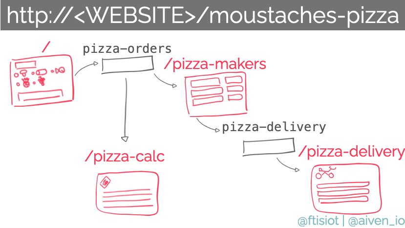

Apache Kafka® on Flask
======================
This repo contains a demo Flask app using Apache Kafka® as backend. It provides examples of:

* Apache Kafka producer and consumer
* Topic partitions and parallel consumers
* Consumer Group
* Kafka Connect sink to Opensearch

Overview
========
An overview of the flask app is provided in the above diagram



The Flask app contains the following endpoints:

* `/`: to view the list of pizza options and place an order in the `pizza-orders` topic
* `/pizza-makers`: to view the `pizza-orders` topic data and act as a "pizzaiolo" making a pizza and sending it to delivery (`pizza-delivery` topic). The example supports up to 2 parallel `pizza-makers` sessions, if more than one is open each of the sessions will show up only data coming from a single Kafka topic partition
* `/pizza-ready/<id>`: when a pizza is ready, the pizzaiolo will be able to click the related button in `/pizza-makers` page and the order will be added to the `pizza-delivery` topic by calling this endpoint
* `/pizza-calc`: to view the `pizza-orders` topic data as a billing person. This consumer is associated to a different consumer group compared to `pizza-makers` so both will receive the same order
* `/pizza-delivery`: to view the `pizza-delivery` topic data.

Setup
============

1. Create a virtual environment

```
python3 -m venv kafka-flask
source kafka-flask/bin/activate
```

2. Install the required dependencies

```
pip install -r requirements.txt
```

3. Copy the `env.conf.example` to `env.conf` and customize the parameters for `TOKEN` and `PROJECT_NAME`

4. Create Aiven for Apache Kafka (requires [jq](https://stedolan.github.io/jq/) to be installed)

```
code/start-services.sh
```

This code will create:
    * An Aiven for Apache Kafka service named `demo-kafka` in the project passed as parameter
    * A local folder called `certs` containing the required SSL certificate files required for the connection
    * An environment file `code/kafka-endpoint-conf.py` containing the Aiven for Apache Kafka service endpoints
    * An Aiven for Opensearch service named `demo-opensearch` in the project passed as parameter
    * An Kafka Connect configuration file `code/opensearch_sink.json` allowing to sink the `pizza-orders` data into an OpenSearch Index

5. To start the flask app execute

```
python code/app.py
```

6. Open the following windows in a browser to check the various endpoints

    * `http://127.0.0.1:5000/`: to view the list of pizza options and place an order in the `pizza-orders` topic
    * `http://127.0.0.1:5000/pizza-makers`: to view the `pizza-orders` topic data and act as a "pizzaiolo" making a pizza and sending it to delivery (`pizza-delivery` topic). The example supports up to 2 parallel `pizza-makers` sessions, if more than one is open each of the sessions will show up only data coming from a single Kafka topic partition
    * `http://127.0.0.1:5000/pizza-calc`: to view the `pizza-orders` topic data as a billing person. This consumer is associated to a different consumer group compared to `pizza-makers` so both will receive the same order
    * `http://127.0.0.1:5000/pizza-delivery`: to view the `pizza-delivery` topic data.

7. Optionally, execute the following code to start the Kafka Connect connector to sink the `pizza-orders` topic data to Opensearch

8. To delete all services run

```
code/delete-services.sh
```


License
============
Apache Kafka® on Flask is licensed under the Apache license, version 2.0. Full license text is available in the [LICENSE](LICENSE) file.

Please note that the project explicitly does not require a CLA (Contributor License Agreement) from its contributors.

Contact
============
Bug reports and patches are very welcome, please post them as GitHub issues and pull requests at https://github.com/ftisiot/flask-apache-kafka-demo. 
To report any possible vulnerabilities or other serious issues please see our [security](SECURITY.md) policy.
